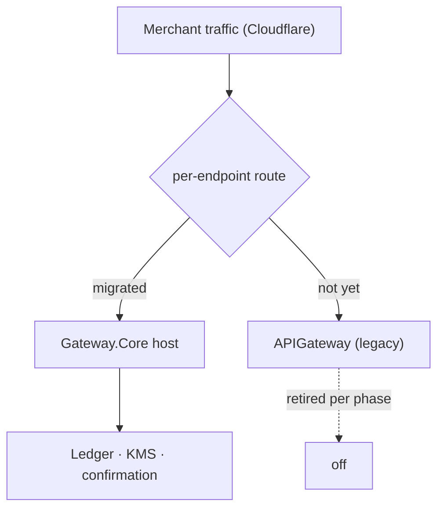

# APIGateway → Gateway.Core — Merge & Migration Plan

> Companion to [architecture-comparison-apigateway-vs-core.md](architecture-comparison-apigateway-vs-core.md).
> That doc argues *why* we merge onto Core. This one is the *how*: a component-by-component
> migration, in order, with test checkpoints and done-criteria for each phase.

## Guiding principles

1. **Money-spine first, edge last.** Correctness (ledger, custody, confirmation) is already in Core.
   We bring the merchant *flow* to it, not the other way round.
2. **Frozen contracts are law.** The merchant-facing surface (`X-Api-Key`/HMAC, the 4 endpoints,
   the callback signature, `/pay/{ref}`) must byte-for-byte match `APIGateway` so no merchant re-integrates.
3. **Strangler, not big-bang.** Stand Core's host up beside `APIGateway`, move traffic per-endpoint,
   keep a rollback at every step.
4. **Every phase ships tested.** No phase is "done" until its checkpoint passes against the real flow.
5. **Display ↔ base-unit conversion happens only at the host edge.** Everything inward is `BigInteger`.

## Legend

`✅ done` · `🔜 next` · `⏳ planned` · `→` = "moves to". Their files are under `APIGateway/`; Core files under `src/Gateway.Core/` unless noted.

---

## Phase 0 — Rotate committed secrets (do this now, independent of the merge)

`APIGateway/appsettings.json` contains **live production DB credentials and a TronGrid API key**, and they are in git history. This is the single most urgent item and it does not depend on any merge decision.

- [ ] Rotate the SQL Server credentials.
- [ ] Rotate (regenerate) the TronGrid API key.
- [ ] Remove the secrets from `appsettings.json`; move to environment / a secret store.
- [ ] Purge them from git history (`git filter-repo` / BFG) and force-push, or accept the repo is burned and start a clean one.

**Done when:** no secret is retrievable from the working tree or history, and the old ones are revoked.

---

## Phase 1 — Money-spine foundations onto Core  ✅ done

This is the slice already built and tested on Core. Recorded here so the plan is complete.

| Their concept | Core target | Status |
|---|---|---|
| `Merchant.Balance` read (`/balance`) | `ILedgerQuery.GetMerchantBalanceAsync` — derives *available* balance from the `MerchantLiability` account cache, excludes reserved | ✅ |
| HMAC verify/sign secret handling | `MerchantApiCredential.SigningSecretCipher` (AES-256-GCM, KMS-swappable) + `IMerchantRequestVerifier` / `IMerchantCallbackSigner` — secret never leaves the module | ✅ |
| Deposit intent + pooled/reused address + FIFO match + pay reference | `PaymentProcessing/PaymentIntent` module (schema `paymentintent`): `PaymentIntent` aggregate, `PublicReference`, reuse-or-mint, idempotent-per-deposit match, expiry worker | ✅ |
| Address minting | `IDepositAddressProvisioner` (Wallet.Contracts) — "deposit address = one merchant for life" | ✅ |
| Invoice ↔ address correlation | `DepositConfirmed` carries `WalletId` (additive; Ledger consumer unaffected) | ✅ |

**Checkpoint (passing):** deposit credit flows through the ledger (double-entry), balance is derived, PaymentIntent matches a confirmed deposit idempotently, and matching sits *outside* the money path so a missing intent never blocks a credit.

---

## Phase 2 — Merchant host edge (the frozen API)  🔜 next

Port `APIGateway`'s merchant-facing HTTP surface onto the Core `MerchantGateway` host, using Core's verifier and modules underneath. **This is where the contracts must match exactly.**

| Move | From (`APIGateway`) | To (Core) |
|---|---|---|
| API-key resolve + HMAC/IP filter | `Middleware/ApiKeyAuthMiddleware.cs`, `Filters/MerchantSecurityFilter.cs`, `Services/Auth/MerchantAuthService.cs` | Host middleware/filter calling `IMerchantRequestVerifier` |
| `POST /deposit` | `Controllers/Merchant/DepositController.cs` → `Core/Services/DepositService.cs` | Host endpoint → `PaymentIntent` create + `IDepositAddressProvisioner` |
| `POST /withdraw` | `Controllers/Merchant/WithdrawalController.cs` → `WithdrawalService.cs` | Host endpoint → Withdrawal module (`IWithdrawalLedger` reserve) |
| `POST /balance` | `Controllers/Merchant/BalanceController.cs` | Host endpoint → `ILedgerQuery.GetMerchantBalanceAsync` |
| `POST /transactions/query` | `Controllers/Merchant/TransactionController.cs` | Host endpoint → module read models |
| `GET /pay/{ref}` + `/pay/{ref}/info` | `Controllers/PayController.cs` | Host endpoint → `PaymentIntent` by `PublicReference` |
| `ApiResponse` shape + error mapping | `Shared/Models/ApiResponse.cs` | One `Result<T>` → `ApiResponse` mapper at the host (§7.1) |
| Display ↔ base-unit conversion | (implicit, everywhere) | **Edge-only** converter using `Asset` display-decimals |

**Test checkpoints:**
- [ ] Contract tests: a request signed with an existing merchant key + the *exact* `"{timestamp}\n{body}"` HMAC verifies identically on Core (reuse a captured `APIGateway` request as a golden vector).
- [ ] Response shape diff: `deposit`/`withdraw`/`balance`/`transactions` bodies match `APIGateway` field-for-field (including money as display decimals).
- [ ] `/pay/{ref}/info` returns `{ address, amount, expiresAt, status }` unchanged.
- [ ] 5-minute replay window + constant-time compare + IP allow-list behave identically.

**Done when:** a merchant integration pointed at the Core host cannot tell it moved.

---

## Phase 3 — Outbound callbacks  ⏳

Port the callback machinery onto Core's signer so outbound notifications keep the frozen signature.

| Move | From | To |
|---|---|---|
| Retry/backoff/abandon loop | `UsdtService/Services/CallbackService.cs` | Core Notification worker |
| Callback signature | `MerchantAuthHelper.SignCallback` | `IMerchantCallbackSigner` (secret stays in Merchant module) |
| Payload `{ transactionId, data:{…} }` | `BuildDepositPayload` / `BuildWithdrawalPayload` | Same shapes; money as display decimals at the edge |
| Trigger | inline in scraper + `ProcessPendingCallbacks` | Consume `DepositConfirmed` / `WithdrawalConfirmed` via outbox |

> Note the key correctness change: in `APIGateway` the **balance credit lived inside** `SendDepositCallback`. On Core the credit is already done by the Ledger handler on `DepositConfirmed`; the callback is *only* a notification. Decoupling is the point — a down webhook can never affect a balance.

**Test checkpoints:**
- [ ] Callback body + `X-Timestamp`/`X-Signature` verify against a merchant's existing verifier.
- [ ] Retry → backoff → abandon after N attempts; delivery status persisted.
- [ ] Killing the merchant endpoint mid-flight leaves the ledger balance correct.

**Done when:** merchants receive byte-compatible callbacks and no callback path can move money.

---

## Phase 4 — Real TRON write path + KMS signer  ⏳ (unblocks prod withdrawals)

Today Core's withdrawal build/sign/broadcast uses in-memory fakes; prod withdrawal is intentionally inert until a real signer exists (never a fake signer in prod, §10). This phase ports `TronService`'s *mechanics* while removing the in-process key.

| Move | From (`APIGateway`) | To (Core) |
|---|---|---|
| TRC-20 transfer build + broadcast | `TronService.Transfer` / `TransferUsdt` / `TransferTrx` | Real `ITransactionBuilder` + `ITransactionBroadcaster` (Blockchain/Infrastructure/Providers/Tron) |
| Base58 ↔ hex, TRC-20 decode | `TronService.ToHexAddress` / `ToBase58Address` | Already have encoders; reconcile against theirs (fixture-tested) |
| Confirmation read | `TronService.VerifyTransaction` | `IConfirmationTracker` — but **gated by policy N-confirmations**, not first-inclusion |
| **Signing** | `Account(privateKeyHex)` in-process | `ISigner` bound to **KMS/HSM** — app passes unsigned blob, gets signed blob |
| Deposit key storage | `WalletEntity.PrivateKey` in DB | **Removed.** Derivation in KeyManagement; `ISecretProvider` (KMS) for provisioning |

**Test checkpoints:**
- [ ] Unsigned-tx fixture builds identically to a known-good `APIGateway` broadcast (money-critical vector).
- [ ] Signer port returns a valid signature with **no private key in the process or DB** (assert nothing key-shaped is persisted).
- [ ] Staging live-node round-trip: build → KMS-sign → broadcast → confirm at policy N → ledger settle.
- [ ] Reorg after confirm posts a compensating ledger entry.

**Done when:** a withdrawal completes end-to-end on staging with keys only ever in KMS.

---

## Phase 5 — TRON operations depth  ⏳ (their strongest asset — they own it)

This is real production know-how Core doesn't have. It moves into AssetManagement as chain adapters/workers, behind capability ports.

| Move | From (`APIGateway`) | To (Core) |
|---|---|---|
| Wallet activation | `TronService` activation | AssetManagement/Treasury adapter |
| Energy rental + low-energy alert | `EnsureSufficientGasFee`, `EnergyTransactionCount`, `PostLowEnergyAlert` | AssetManagement/Energy module + alert |
| Gas top-up | `ProcessWithdrawalUseCase` gas branch | Energy/Treasury adapter (recorded as ledger fee/expense) |
| Profit-guarded sweep | `AutoSweepUseCase`, `AutoSweepHostedService` | AssetManagement/Sweep worker |
| Storage → treasury | `StorageToTreasuryUseCase`, `StorageToTreasuryHostedService` | Treasury worker |

**Test checkpoints:** each op is idempotent, resumable, and posts any fee movement to the ledger (no off-ledger money).

**Done when:** sweeps/top-ups/rentals run under Core's workers and every asset movement is on the ledger.

---

## Phase 6 — Back-office & merchant portal re-point  ⏳

`Bo` (RBAC) and `MerchantBo` (portal) keep their UIs but stop reading raw tables; they read Core through module contracts / read models.

- [ ] `Bo` balance/transaction/wallet views read `ILedgerQuery` + module read models, not `Merchant.Balance` / raw `tblWallet`.
- [ ] Manual balance adjustments (`AdjustBalanceRequest`, `OverrideTransactionRequest`) become **compensating ledger journals**, never column writes.
- [ ] RBAC tables move to their own module/schema (out of the single `AppDbContext`).

**Done when:** no back-office action mutates a balance column; every adjustment is an auditable journal.

---

## Cutover strategy (strangler)

1. Deploy Core host alongside `APIGateway`.
2. Move **read-only** endpoints first (`/balance`, `/transactions/query`) — lowest blast radius.
3. Move `/deposit` (new intents on Core; let in-flight legacy intents drain).
4. Move `/withdraw` only after Phase 4 (KMS signer) is green on staging.
5. Switch callbacks to Core once Phase 3 verifies.
6. Retire `APIGateway` services one worker at a time; keep its DB read-only for reconciliation until parity is proven.

**Rollback:** each endpoint route flips back to `APIGateway` independently; because contracts are frozen, a flip is invisible to merchants.

---

## Reconciliation gate (before retiring legacy)

Before turning `APIGateway` off, prove the ledger reproduces legacy balances:

- [ ] For every merchant, `ILedgerQuery` available balance == legacy `Merchant.Balance` (± known in-flight).
- [ ] Every historical deposit/withdrawal has a corresponding journal (or a documented exception).
- [ ] Spot-check: pick N merchants, replay their transaction history through the ledger, confirm the derived balance matches.

**Done when:** balances reconcile and the ledger is the sole source of truth in production.

---

## One-screen summary

| Phase | What | Gate |
|---|---|---|
| 0 | Rotate committed secrets | secrets revoked + purged |
| 1 ✅ | Money-spine foundations | credit via ledger, idempotent match |
| 2 🔜 | Frozen host edge | merchants can't tell it moved |
| 3 | Callbacks | byte-compatible, off the money path |
| 4 | Real TRON write + KMS signer | withdrawal on staging, keys in KMS only |
| 5 | TRON ops depth | sweeps/top-ups on-ledger |
| 6 | BO/portal re-point | no column-write balance changes |
| Cutover | strangler per-endpoint | reconciliation passes, legacy retired |
