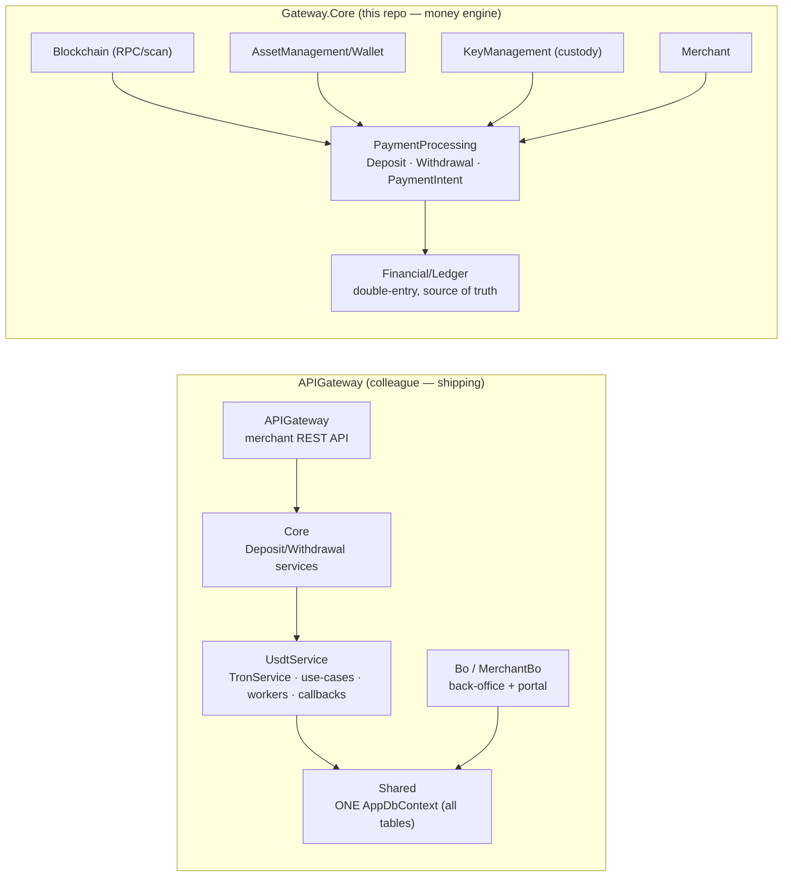
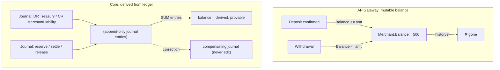
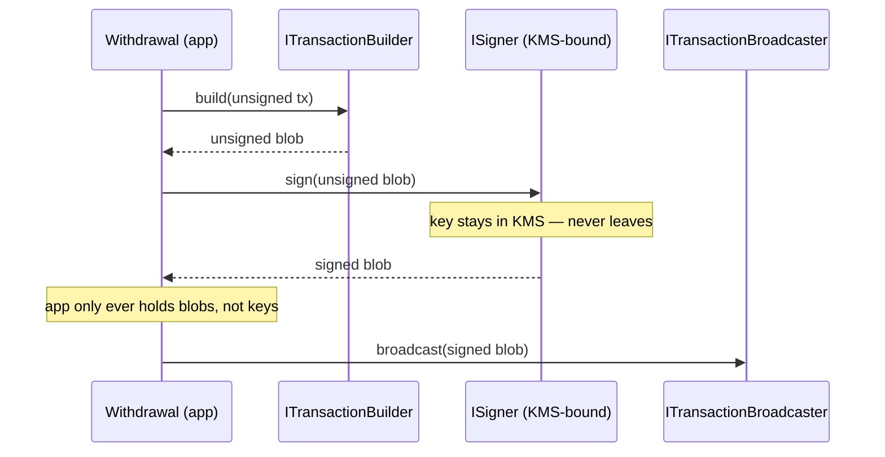
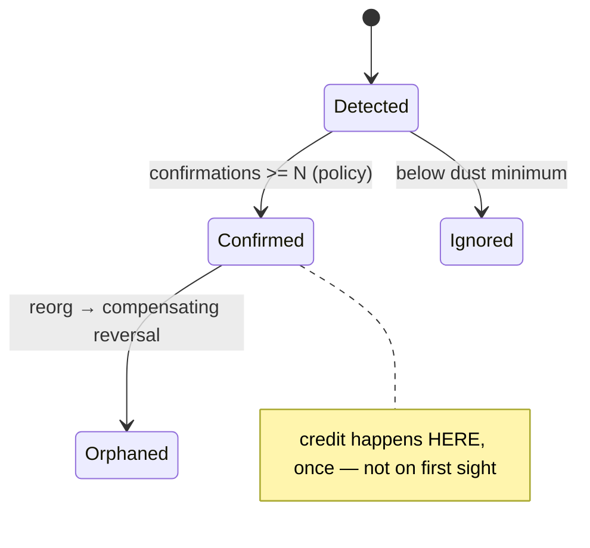
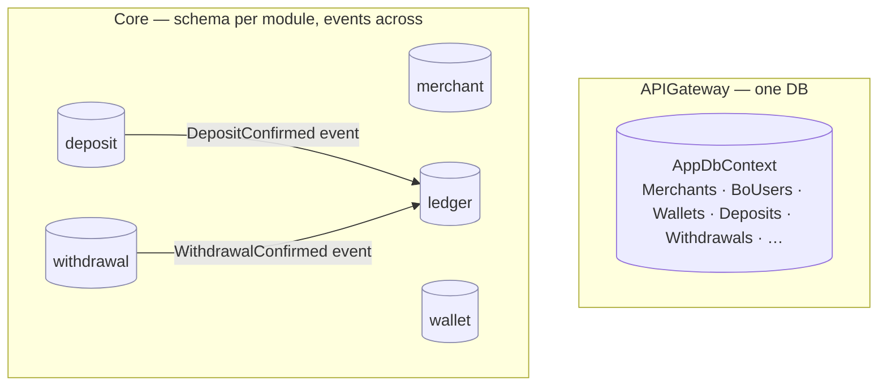
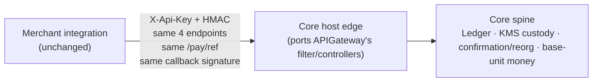

# APIGateway vs. Gateway.Core — Architecture Comparison & Merge Rationale

> **Purpose.** We have two working codebases that do overlapping things:
> the shipping **`APIGateway`** solution (USDT-on-TRON, built to make the merchant use‑case
> flow work end‑to‑end) and the **`Crypto.Gateway.Core`** solution (a Modular Monolith + DDD
> money engine). This document explains, for a fellow backend engineer, **exactly where they
> overlap**, **what is in Core**.**
>
> **Tone up front:** the `APIGateway` work is good and it ships. Everything valuable in it —
> the merchant flow, the TRON operations depth, the HMAC contracts — we **keep**. The argument
> below is narrow and specific: the *money spine* (how balances are stored, how keys are held,
> how deposits are confirmed) has non‑negotiable correctness requirements, and Core already
> satisfies them while `APIGateway` cannot without a rewrite of those exact parts.

---

## 0. TL;DR — read this first

| Question | Answer |
|---|---|
| Do they overlap? | Heavily — same product, same auth contracts, same TRON/EF/Redis stack, same deposit-address pooling and pay page. |
| Is `APIGateway` bad? | **No.** It's a correct *use‑case prototype* of the full merchant journey. It proved the flow. |
| So why move? | Three parts of `APIGateway` are structurally unsafe for real money and **cannot be patched in place**: (1) balances are a **mutable column**, (2) **private keys live in the DB** and sign in‑process, (3) deposits are **credited on first block inclusion with no reorg reversal**. |
| Does Core already fix these? | Yes — double‑entry immutable ledger, KMS signer port (app never holds keys), and a confirmation/reorg state machine. Built and tested. |
| Do merchants notice the move? | **No.** The external contracts (`X-Api-Key`/HMAC, the 4 endpoints, callback signature, `/pay/{ref}`) are **frozen and preserved** at Core's host edge. |
| What do we throw away? | Almost nothing. The flow logic, TRON ops, and callbacks port over as adapters behind Core's ports. |

**One-line version:** *Keep the `APIGateway` flow, move it onto Core's ledger + custody + confirmation spine. Merchants see the same API; we get correctness we can be audited on.*

---

## 1. Two codebases, one product



| | `APIGateway` | `Gateway.Core` |
|---|---|---|
| **Shape** | Traditional layered, service-oriented | Modular Monolith + DDD |
| **Scope** | USDT-on-TRON only | Multi-asset by design (TRON now; ETH/SOL as adapters) |
| **Persistence** | **One** `AppDbContext`, all tables together | **One DbContext + schema per module**, no cross-module FKs |
| **Balance** | Mutable `Merchant.Balance` column | Derived from an immutable double-entry ledger |
| **Money type** | `decimal(20,8)` — display units | `BigInteger` base units, stored `DECIMAL(38,0)` |
| **Keys** | Stored in DB / config, signed in-process | Never in app; behind a signer port (KMS-bound) |
| **Deposit credit** | On first block inclusion; no reorg reversal | At N confirmations; reorg posts a compensating entry |
| **Extractable to services?** | No — one DB welds everything | Yes — every module is microservice-ready by contract |
| **Primary strength** | **The end-to-end merchant flow works today** | **Financial correctness, custody, auditability** |

The two solutions are not competitors — they're **two halves**. `APIGateway` is the *flow*; Core is the *spine*. The merge glues the proven flow onto the correct spine.

---

## 2. The overlap map (feature-by-feature)

This is the "what did they already build" table. **Verdict** = what we do on merge.

| Capability | `APIGateway` has it? | `Gateway.Core` has it? | Verdict on merge |
|---|---|---|---|
| Merchant auth (`X-Api-Key` + HMAC, 5-min window, IP allow-list) | ✅ `MerchantSecurityFilter`, `ApiKeyAuthMiddleware` | ✅ `IMerchantRequestVerifier` (secret held encrypted) | **Keep contract**, port to Core's verifier |
| 4 merchant endpoints (`/deposit /withdraw /balance /transactions/query`) | ✅ Controllers | ⏳ host edge (next step) | Port controllers → Core host, same shapes |
| Hosted pay page (`/pay/{ref}`) | ✅ `PayController` | ✅ `PaymentIntent` + `PublicReference` | Reuse Core's PaymentIntent invoice |
| Deposit-intent → pooled/reused address | ✅ `CreateWalletUseCase` | ✅ `PaymentIntent` + `IDepositAddressProvisioner` | **Core's version** (see §4.5) |
| Expected-amount FIFO match | ✅ `ProcessDepositUseCase` | ✅ `PaymentIntent` matcher (idempotent per deposit) | **Core's version** |
| Deposit detection (TRC-20 via eth-compatible RPC) | ✅ `TronService` + scraper | ✅ `TronChainAdapter` (`eth_getLogs`) | Merge: Core's ports, their RPC know-how |
| Confirmation / reorg handling | ⚠️ reads confirmations, **doesn't gate**, no reversal | ✅ policy threshold + `MarkOrphaned` compensation | **Core** (correctness) |
| Balance / ledger | ⚠️ mutable column | ✅ double-entry, append-only | **Core** (non-negotiable) |
| Withdrawal money-out | ✅ deduct column → broadcast → refund on fail | ✅ reserve → sign → settle/release via events | **Core** (atomic reserve) |
| Key custody / signing | ⚠️ private keys in DB + config | ✅ signer port, app holds only blobs | **Core** (non-negotiable) |
| TRON ops (activation, energy rental, gas top-up, sweep) | ✅ deep, real, valuable | ❌ not built | **Keep theirs** → Core adapters |
| HMAC-signed callbacks + retry/backoff/abandon | ✅ `CallbackService` | ⏳ step 6 | **Port theirs** onto `IMerchantCallbackSigner` |
| Back-office RBAC + merchant portal | ✅ `Bo` + `MerchantBo` | ❌ not built | **Keep theirs** (reads Core via contracts) |

Legend: ✅ built · ⚠️ built but structurally unsafe for money · ⏳ in progress · ❌ not built.

**Reading of the table:** the overlap is real, but it's *complementary*. Where both have it, Core wins on the money-critical rows and the two tie on the plumbing. Where only one has it, we keep whichever exists. Nothing of value is discarded.

---

## 3. Where they're already the same (and that's fine)

It's worth being explicit that this is **not** a "throw it all away" argument. These decisions match, and the merge inherits them unchanged:

- **SQL Server + EF Core** as the system of record.
- **Redis** for distributed locks / single-flight (`RedisService` ↔ `IDistributedLockFactory`).
- **HMAC-SHA256 over `"{timestamp}\n{body}"`**, 5-minute replay window, constant-time compare — *identical scheme*. Core already holds the merchant signing secret encrypted (AES-256-GCM, KMS-swappable) so it can both verify inbound and sign outbound.
- **TRON read via the eth-compatible JSON-RPC surface** (`eth_getLogs` / receipts). Their `TronService` and Core's `TronChainAdapter` took the same approach; theirs is the richer seed for the write path.
- **Pooled + reused deposit addresses** and a **hosted pay page** keyed by a public reference.
- **Callbacks with exponential backoff and an abandon cap.**

So the disagreement is narrow. It's about **three money-spine invariants**, covered next.

---

## 4. The differences that matter — the case for Core

Five differences. The first four are *correctness/security*; the fifth is *structure*. Each shows the actual `APIGateway` code, the concrete failure it allows, and Core's equivalent.

### 4.1 Money model — a mutable `Balance` column vs. an immutable double-entry ledger

**What `APIGateway` does.** A merchant's money is a single mutable number, credited and debited in place.

```csharp
// Shared/Data/Entities/Merchant.cs
public decimal Balance { get; set; } = 0;

// UsdtService/Services/CallbackService.cs  — credit on deposit
await db.Merchants.Where(m => m.Id == depositMerchantGuid)
    .ExecuteUpdateAsync(s => s.SetProperty(m => m.Balance, m => m.Balance + deposit.DepositAmount));

// Shared/Repositories/MerchantRepository.cs  — debit on withdrawal (raw SQL)
"UPDATE Merchants SET Balance = Balance - {amount} WHERE Id = {id} AND Balance >= {amount}"
```

**Why this is dangerous for a payments product:**
- **No history.** The current number is *all there is*. You cannot answer "why is this balance what it is?" or reconstruct it after a bug. For a money product, the audit trail **is** the product.
- **Credit is coupled to callback bookkeeping.** The credit fires inside `SendDepositCallback` gated on `CallBackMerchantTry == 0`. Any change to callback retry logic risks double- or zero-crediting.
- **Corrections mutate history.** A wrong balance is fixed by overwriting it — the previous truth is gone.

**What Core does.** Balance is **derived**, never stored. Every money event is a **balanced, immutable journal** of double-entry lines; the balance is the sum of an account's entries.

```csharp
// Financial/Ledger/Domain/Journal.cs — a posting is unconstructable unless it balances
if (lines.Count < 2)               return Result.Failure<Journal>(LedgerErrors.JournalNeedsTwoLines);
if (totalDebit != totalCredit)     return Result.Failure<Journal>(LedgerErrors.Unbalanced);
// (ReferenceType, ReferenceId) is UNIQUE → one business event posts exactly one journal (idempotent)
```



**Payoff:** every balance is reconstructable from immutable entries; corrections are compensating journals (§14); the deposit credit is **decoupled** from callback delivery — a merchant's webhook being down can never corrupt their balance. This is the single most important reason the money spine in Core's.

---

### 4.2 Money type — `decimal(20,8)` display values vs. `BigInteger` base units

**What `APIGateway` does.** Money is a scaled decimal in *display* units throughout — DB columns are `HasPrecision(20, 8)`, and math happens on those display values:

```csharp
// AppDbContext.cs
e.Property(x => x.DepositAmount).HasPrecision(20, 8);
// ProcessDepositUseCase.cs — tolerance compare because display decimals don't compare cleanly
amountMatched = Math.Abs(amount - pending.ExpectedAmount.Value) < 0.000001m ? (byte)1 : (byte)0;
```

**Why this is risky:** `decimal(20,8)` fits USDT (6 dp) but silently mis-models assets with more precision (ETH/wei = 18 dp). Doing arithmetic on display values forces epsilon comparisons and accumulates rounding — exactly what you must never do with money. Adding a second asset means revisiting every column and every calculation.

**What Core does.** Money is an **integer count of base units** (`sun`, `wei`, `lamports`) as `System.Numerics.BigInteger`, stored `DECIMAL(38,0)` via a custom `BigIntegerTypeMapping`. Comparisons are exact (`==`), never epsilon. Display decimals are asset metadata, applied only at the API/UI edge.

| | `APIGateway` | `Core` |
|---|---|---|
| In-domain type | `decimal` (display) | `BigInteger` (base units) |
| Storage | `DECIMAL(20,8)` | `DECIMAL(38,0)` |
| Compare | `Math.Abs(a-b) < 1e-6` | exact `==` |
| New asset (18 dp) | column + math rework | just metadata |

This is CLAUDE.md §14 and the reason a display-decimal model can't be the spine.

---

### 4.3 Custody — private keys in the DB / config vs. a signer port the app never sees behind

**What `APIGateway` does.** Deposit-wallet private keys are generated and **stored in the database**; hot-wallet keys live in **config**; signing happens **in-process** with the raw key.

```csharp
// Shared/Data/Entities/WalletEntity.cs
public string PrivateKey { get; set; } = null!;            // ← key material in a DB column

// UsdtService/UseCases/CreateWalletUseCase.cs
var (address, privateKey) = tron.GenerateWallet();
lockedWallet = new WalletEntity { ..., PrivateKey = privateKey };   // persisted

// UsdtService/UseCases/ProcessWithdrawalUseCase.cs — signs with a hot key from config
txHash = await tron.Transfer(_wallets.StorageAddress, _wallets.StoragePrivateKey, toAddress, amount, tokenType);
```

**Why this is the highest-severity item:** a single DB read (SQLi, backup leak, rogue query, over-broad ops access) exfiltrates **every deposit key** and the hot wallet — i.e. drains funds. Keys in config land in process memory, crash dumps, and `appsettings` history. This violates the cardinal rule of custody: **the application must never hold key material.**

**What Core does.** Key *derivation* is isolated in **KeyManagement**; signing is behind a **port** (`ISigner`) — the application only ever passes an **unsigned blob** out and gets a **signed blob** back. Dev uses an `InMemorySigner`; production binds the port to a **KMS/HSM**. The private key never enters the gateway process or the DB.



Their `TronService.Transfer` is still valuable — it becomes the *body* of Core's real `ITransactionBuilder`/`ITransactionBroadcaster`, **minus** the in-process key. The signing step moves behind `ISigner`.

---

### 4.4 Deposit safety — credit on first block inclusion vs. a confirmation + reorg state machine

**What `APIGateway` does.** `VerifyTransaction` returns `Confirmed = true` **as soon as a receipt exists with status 1** — that is, the moment the tx is mined into *any* block. It computes a `confirmations` count but **never gates on it**, and once credited there is **no reversal path** if that block is later orphaned.

```csharp
// UsdtService/Services/TronService.cs
if (receipt == null)            return new TxVerification { Confirmed = false, ... }; // not mined
if (receipt.Status.Value != 1)  return new TxVerification { Confirmed = false, ... }; // failed
var confirmations = (long)(currentBlock.Value - receipt.BlockNumber.Value);           // computed…
return new TxVerification { Confirmed = true, Confirmations = confirmations, ... };    // …but not required

// DepositScraperService.cs — credits as soon as Confirmed is true
if (!verification.Confirmed) continue;   // 0 confirmations is enough
```

**The concrete failure:** a deposit is credited at 0–1 confirmations; the chain reorgs and drops that block; the funds never actually settle — but the merchant balance was already incremented, permanently. There is no compensating entry because there is no ledger and no orphan handling. Money invented from a reorg.

**What Core does.** The `Deposit` aggregate credits **only at the policy confirmation threshold**, and if a *confirmed* deposit is later orphaned it raises a **compensating** `DepositOrphaned` event that reverses the ledger credit.

```csharp
// PaymentProcessing/Deposit/Domain/Deposit.cs
if (policy.IsCreditable(Confirmations, isFinalized)) {        // gate on N confirmations / finality
    Status = DepositStatus.Confirmed;
    Raise(new DepositConfirmed(...));                          // → ledger credits, once
}
// …and on reorg:
if (wasCredited) Raise(new DepositOrphaned(...));              // → ledger posts a reversal
```



This is CLAUDE.md §9 (reorg handling) and the difference between "probably settled" and "provably settled."

---

### 4.5 Structure — one `AppDbContext` vs. a modular monolith

**What `APIGateway` does.** A single `AppDbContext` owns *every* table — gateway, BO/RBAC, and USDT/TRON — in one schema.

```csharp
// Shared/Data/AppDbContext.cs
public DbSet<Merchant> Merchants ...
public DbSet<BoUserEntity> BoUsers ...          // RBAC
public DbSet<WalletEntity> Wallets ...          // custody
public DbSet<DepositEntity> Deposits ...        // payments
public DbSet<WithdrawalEntity> Withdrawals ...  // payments
// …all in one context, one migration history, cross-referencing freely
```

**Why it constrains you:** everything is welded to one physical database. You can't scale, deploy, or extract the deposit scanner or the ledger independently; a schema change anywhere is a change everywhere; module boundaries are conventions, not enforced. It's fine for a prototype, limiting for a platform.

**What Core does.** **One DbContext + one schema + one migration history per module**, and modules talk **only** through Contracts/Events — never each other's internals. Each module is independently extractable into its own service later with minimal change (CLAUDE.md §4, §15).



The payoff isn't theoretical: it's what lets the deposit scanner, the ledger, and the callback dispatcher scale and fail independently, and it's the rule set (no module-to-module calls, ledger-only source of truth) that keeps the money code honest as the team grows.

---

## 5. merge *onto* Core and merchants notice nothing

The natural objection is "but `APIGateway` is the one that's live." That's exactly why the merge is safe: **Core preserves the frozen external contracts**, so the surface merchants integrate against does not change. We swap the engine, not the dashboard.



Preserved **exactly** (already recorded as frozen contracts):
- Auth: `X-Api-Key` (SHA-256 lookup) + `X-Timestamp` + `X-Signature` = HMAC-SHA256 over `"{timestamp}\n{body}"`, 5-min window, constant-time compare.
- Endpoints: `POST /api/v1/{deposit,withdraw,balance,transactions/query}`.
- Callback: outbound POST with `X-Timestamp`/`X-Signature`, body `{ transactionId, data: {…} }`.
- Pay page: `GET /pay/{ref}` + `GET /pay/{ref}/info` → `{ address, amount, expiresAt, status }`.
- Money fields in those payloads stay **display decimals** — Core converts base-unit ↔ display **only at the host edge**.

Merchants keep their existing keys, signatures, and payloads. Nothing on their side changes.

---

## 6. What we keep from `APIGateway` (credit where it's due)

This is deliberately a long list, because the point is that the merge is **additive**, not a rewrite of their work:

| From `APIGateway` | Where it lands in Core |
|---|---|
| `MerchantSecurityFilter` + `ApiKeyAuthMiddleware` (HMAC/IP) | Host edge, calling `IMerchantRequestVerifier` |
| Merchant controllers (`Deposit/Withdrawal/Balance/Transaction`) | Core `MerchantGateway` host endpoints (same shapes) |
| `PayController` / pay page | Core `PaymentIntent` (`PublicReference`) |
| `CreateWalletUseCase` pooling/reuse concept | `PaymentIntent` reuse-or-mint + `IDepositAddressProvisioner` |
| `ProcessDepositUseCase` FIFO expected-amount match | `PaymentIntent` matcher (now idempotent per deposit) |
| `TronService` build/broadcast + Base58↔hex + TRC-20 decode | Real `ITransactionBuilder`/`ITransactionBroadcaster` (keys removed) |
| **TRON ops depth** — wallet activation, energy rental + low-energy alert, gas top-up, profit-guarded sweep, storage→treasury | AssetManagement adapters (this is genuinely theirs to own) |
| `CallbackService` retry/backoff/abandon | Notification/callbacks on `IMerchantCallbackSigner` |
| `Bo` RBAC + `MerchantBo` portal | Kept as-is; read Core via contracts, not raw tables |

The TRON operational logic in particular is real production know-how Core doesn't have — that's *their* module to bring over and own.

---

## 7. Risk register — what the move retires

| Risk in `APIGateway` today | Severity | Removed by |
|---|---|---|
| Balance is mutable, non-reconstructable | High | Core ledger (§4.1) |
| Reorg after 0-conf credit → invented funds, no reversal | High | Core confirmation/reorg machine (§4.4) |
| Private keys in DB + hot keys in config, in-process signing | **Critical** | Core signer port + KMS (§4.3) |
| Display-decimal money math (epsilon compares, rounding) | Med–High | Core base-unit `BigInteger` (§4.2) |
| One DB welds all concerns; can't scale/extract | Medium | Core module-per-schema (§4.5) |
| **Live prod DB creds + TronGrid API key committed to git** | **Critical (ops)** | Rotate now + purge from history — independent of the merge |

> The last row is not an architecture issue but it's the most urgent operational one: those secrets are in `APIGateway/appsettings.json` and in git history. **Rotate the DB credentials and the TronGrid key and scrub them from history regardless of what we decide about merging.**

---

## 8. Recommendation

**Merge the `APIGateway` use-case flow onto `Gateway.Core`.** Concretely:

1. **Keep** the frozen merchant contracts, the TRON ops logic, the callback machinery, and the BO/portal.
2. **Move** balances to the ledger, keys behind the signer port, and deposit credit behind the confirmation/reorg gate.
3. **Port** their controllers/filter/callbacks onto Core's host edge and ports so merchants see zero change.
4. **Rotate** the committed secrets today, separately from the merge.

The result: the flow your colleague proved, running on a spine we can put in front of an auditor. We lose none of the working behaviour and gain correctness, custody, and independent scalability — the three things a real money engine cannot ship without.

---

### Appendix — the four money-spine invariants, side by side

| Invariant | `APIGateway` | `Gateway.Core` |
|---|---|---|
| Balance is provable from history | ❌ mutable column | ✅ sum of immutable journal entries |
| Money math is exact | ❌ display decimals + epsilon | ✅ `BigInteger` base units, exact |
| App never holds keys | ❌ keys in DB/config | ✅ signer port, KMS-bound |
| Credit only when settled | ❌ first block inclusion | ✅ N-confirmation gate + reorg reversal |

*Sources: `APIGateway` — `Shared/Data/AppDbContext.cs`, `Shared/Data/Entities/{Merchant,WalletEntity,DepositEntity}.cs`, `Shared/Repositories/MerchantRepository.cs`, `UsdtService/Services/{TronService,CallbackService}.cs`, `UsdtService/UseCases/{CreateWallet,ProcessDeposit,ProcessWithdrawal}UseCase.cs`, `APIGateway/Filters/MerchantSecurityFilter.cs`. Core — `Financial/Ledger/Domain/{Journal,Account}.cs`, `PaymentProcessing/Deposit/Domain/Deposit.cs`, `KeyManagement`/`Blockchain` contracts, `CLAUDE.md` §4/§7/§9/§10/§14/§15.*
