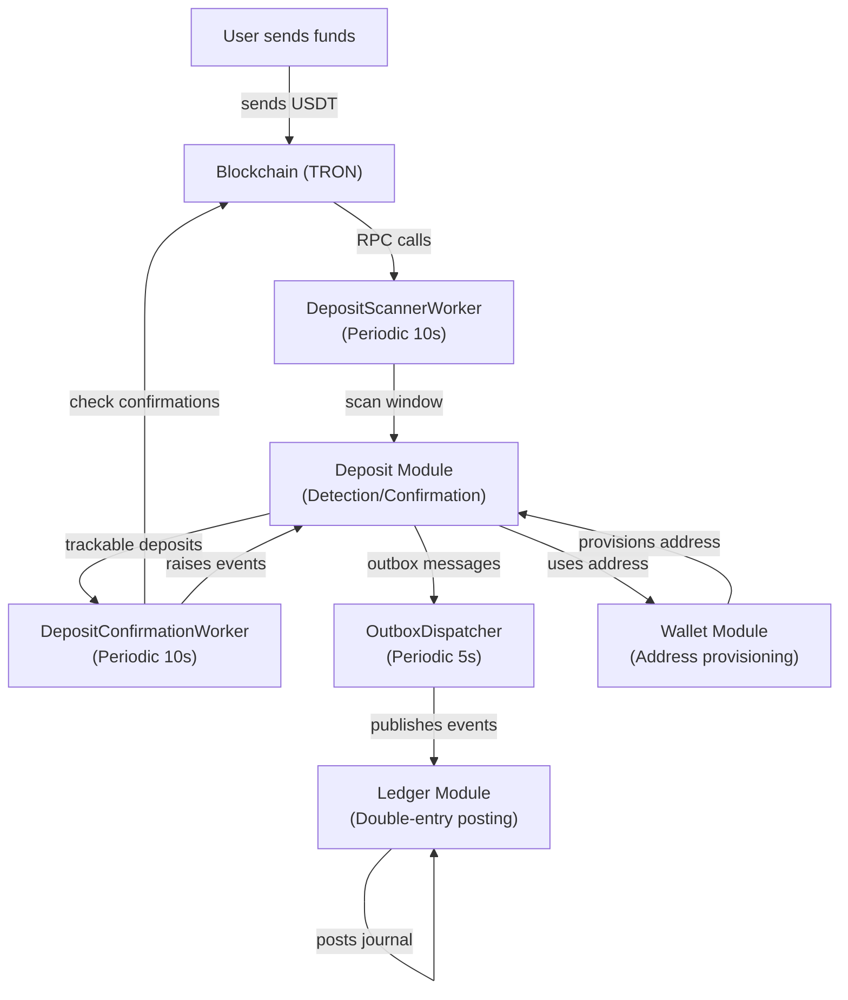
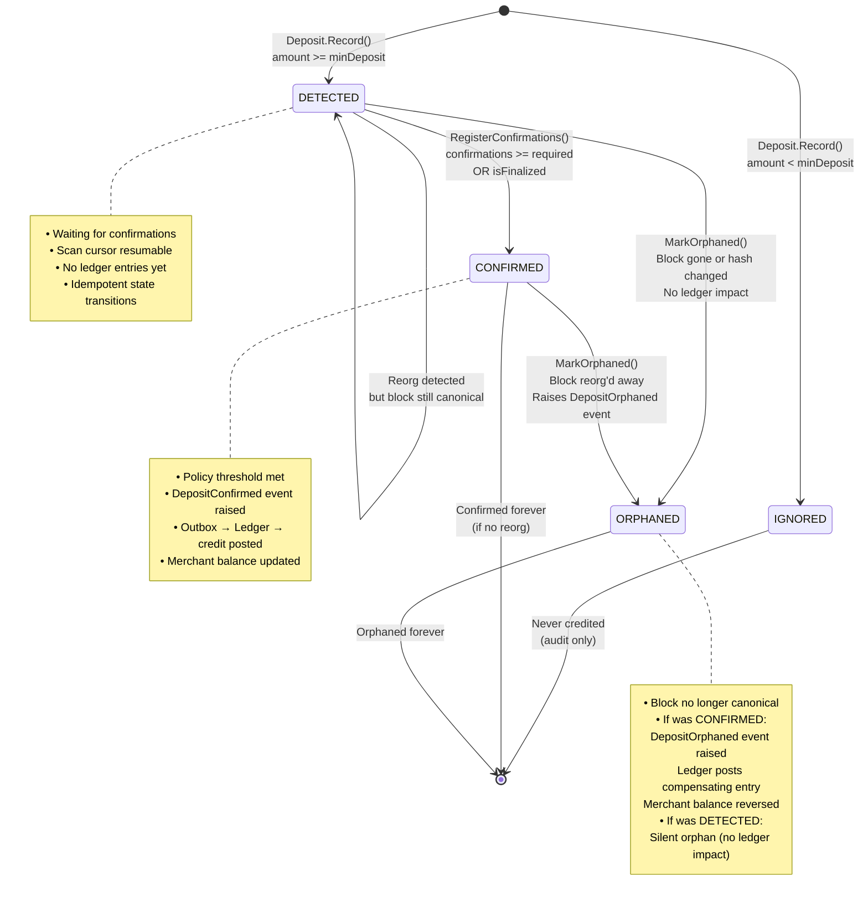
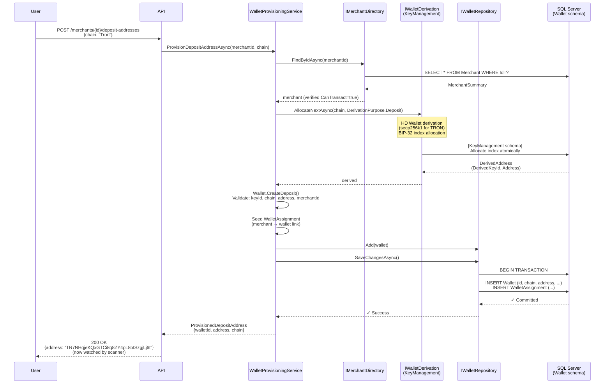
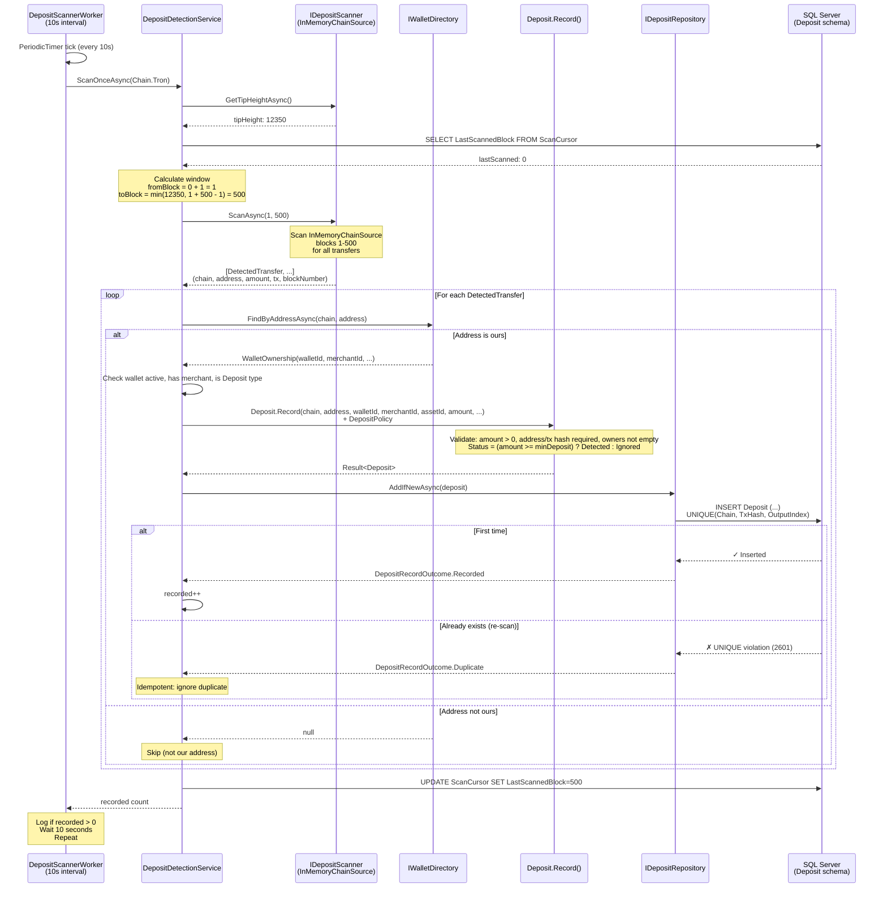
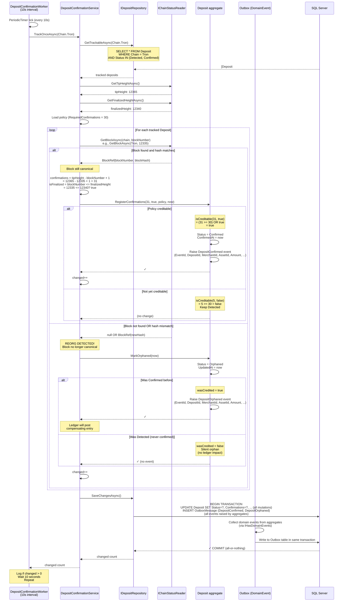
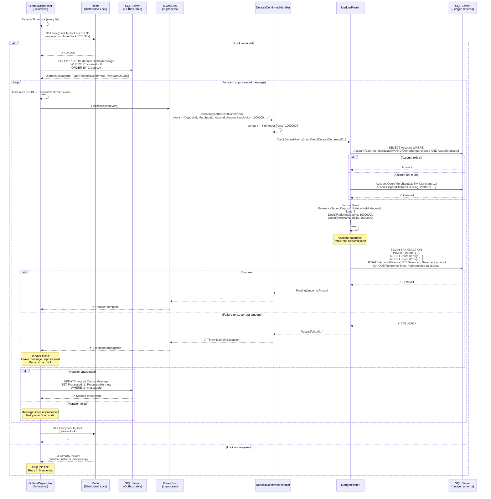
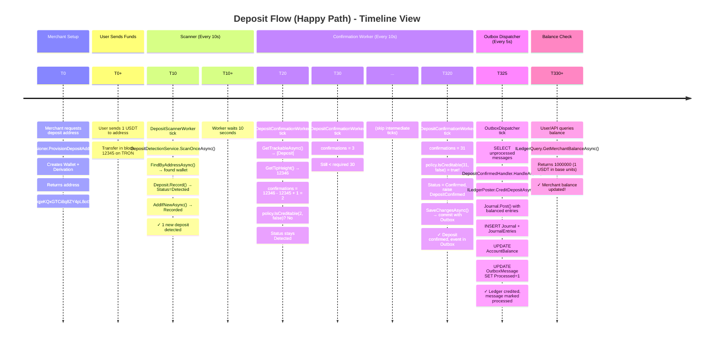
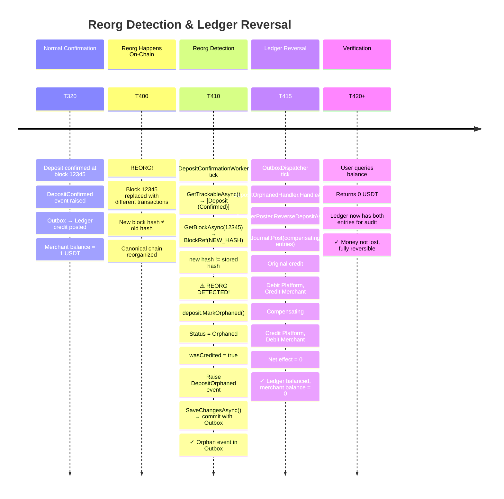
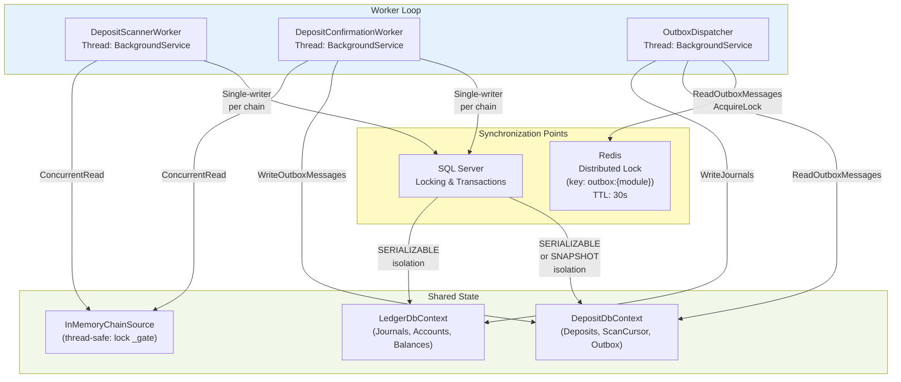

# Deposit Flow — Visual Diagrams & Mermaid Charts

## 1. Module Interaction Diagram

---

## 2. Deposit State Machine (Detailed)

---

## 3. Wallet Provisioning Flow

---

## 4. Deposit Detection & Scanning

---

## 5. Deposit Confirmation & Reorg Detection

---

## 6. Outbox Dispatch & Ledger Integration

---

## 7. Complete Happy Path: Address → Deposit → Confirmation → Credit

---

## 8. Reorg Scenario: Deposit Orphaned After Confirmation

---

## 9. Data Flow (Block Diagram)

```mermaid
graph LR
    subgraph Blockchain["Blockchain (TRON)"]
        Block["Block 12345<br/>TxHash: 0xabc..."]
        Transfer["Transfer<br/>to TR7NHqje...<br/>1 USDT"]
    end
    
    subgraph Deposit["Deposit Module"]
        Scanner["IDepositScanner<br/>(scan 1-500)"]
        Detection["DepositDetectionService<br/>(scan loop)"]
        Deposit_["Deposit aggregate<br/>(Status=Detected)"]
        DepositDB["DepositDbContext<br/>Deposits table"]
        Cursor["ScanCursor<br/>(LastScannedBlock=500)"]
    end
    
    subgraph Wallet["Wallet Module"]
        WalletDir["IWalletDirectory<br/>(find by address)"]
        WalletDB["WalletDbContext<br/>Wallets table"]
    end
    
    subgraph Confirmation["Confirmation & Events"]
        Confirm["DepositConfirmationService<br/>(track once)"]
        ChainStatus["IChainStatusReader<br/>(check block)"]
        Deposit_Confirmed["DepositConfirmed event<br/>(raised by aggregate)"]
        Outbox["OutboxMessage<br/>(durable queue)"]
    end
    
    subgraph Ledger["Ledger Module"]
        Handler["DepositConfirmedHandler<br/>(event consumer)"]
        Poster["ILedgerPoster<br/>(credit deposit)"]
        Journal["Journal<br/>(balanced entries)"]
        JournalEntry["JournalEntry<br/>(debit/credit lines)"]
        AccountBalance["AccountBalance<br/>(merchant balance cache)"]
        LedgerDB["LedgerDbContext<br/>Ledger schema"]
    end
    
    Block -->|Transfer found| Scanner
    Transfer -->|address, amount| Scanner
    Scanner -->|DetectedTransfer| Detection
    Detection -->|FindByAddressAsync| WalletDir
    WalletDir -->|WalletOwnership| Detection
    WalletDB -->|Wallet with address| WalletDir
    Detection -->|Record + AddIfNewAsync| Deposit_
    Deposit_ -->|INSERT + UNIQUE dedup| DepositDB
    DepositDB -->|Deposits table| Cursor
    
    DepositDB -->|GetTrackableAsync| Confirm
    ChainStatus -->|GetTipHeight, GetBlockAsync| Confirm
    Confirm -->|RegisterConfirmations| Deposit_
    Deposit_ -->|Aggregate raises| Deposit_Confirmed
    Deposit_Confirmed -->|Write to Outbox| Outbox
    DepositDB -->|same transaction| Outbox
    
    Outbox -->|Dispatch| Handler
    Handler -->|Parse event| Handler
    Handler -->|CreditDepositAsync| Poster
    Poster -->|Journal.Post| Journal
    Journal -->|Create entries| JournalEntry
    JournalEntry -->|Debit + Credit| Journal
    Journal -->|INSERT| LedgerDB
    JournalEntry -->|INSERT| LedgerDB
    AccountBalance -->|UPDATE Balance| LedgerDB
    
    style Blockchain fill:#e1f5ff
    style Deposit fill:#f3e5f5
    style Wallet fill:#fff3e0
    style Confirmation fill:#e8f5e9
    style Ledger fill:#fce4ec
```

---

## 10. Concurrency & Locks

